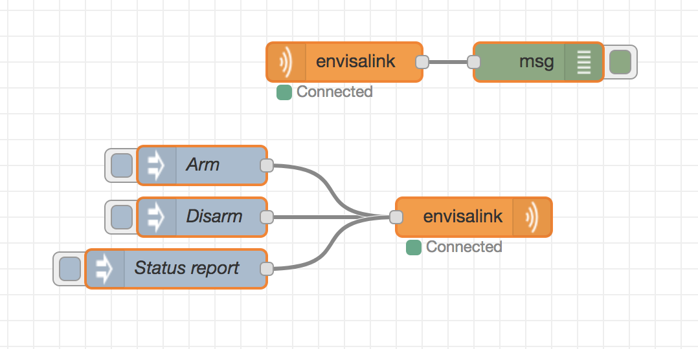

# node-red-contrib-envisalink
[DSC alarm systems] integration with [Node-RED] using the [EnvisaLink] hardware.

This node allows you to listen to state changes in your DSC alarm as well as sending
commands such as arming and disarming of your alarm.

# Install

Run the following command in the root directory of your Node-RED install

    npm install node-red-contrib-envisalink

Run the following command for global install

    npm install -g node-red-contrib-envisalink

# How to use

The output node, with which you send commands, takes a raw TPI command as a string.
Please refer to the [TPI documentation] for a full list of commands.
For example, to arm partition `1` using the code `9999` you would use the command `033` and passing `1` as partition and your code.
The final string to pass in to the output node would be `03319999`.

This plugin is based on work from [NodeAlarmProxy].

# Authors

[Patrik Åkerfeldt]

### History

* based on work from [NodeAlarmProxy].

[Node-RED]:           http://nodered.org/
[DSC alarm systems]:  http://www.dsc.com/
[EnvisaLink]:         http://www.eyezon.com/
[TPI documentation]:  https://github.com/pakerfeldt/node-red-contrib-envisalink/raw/master/docs/EnvisaLinkTPI-1-08.pdf
[Patrik Åkerfeldt]:   https://github.com/pakerfeldt
[NodeAlarmProxy]:     https://github.com/entrocode/NodeAlarmProxy
